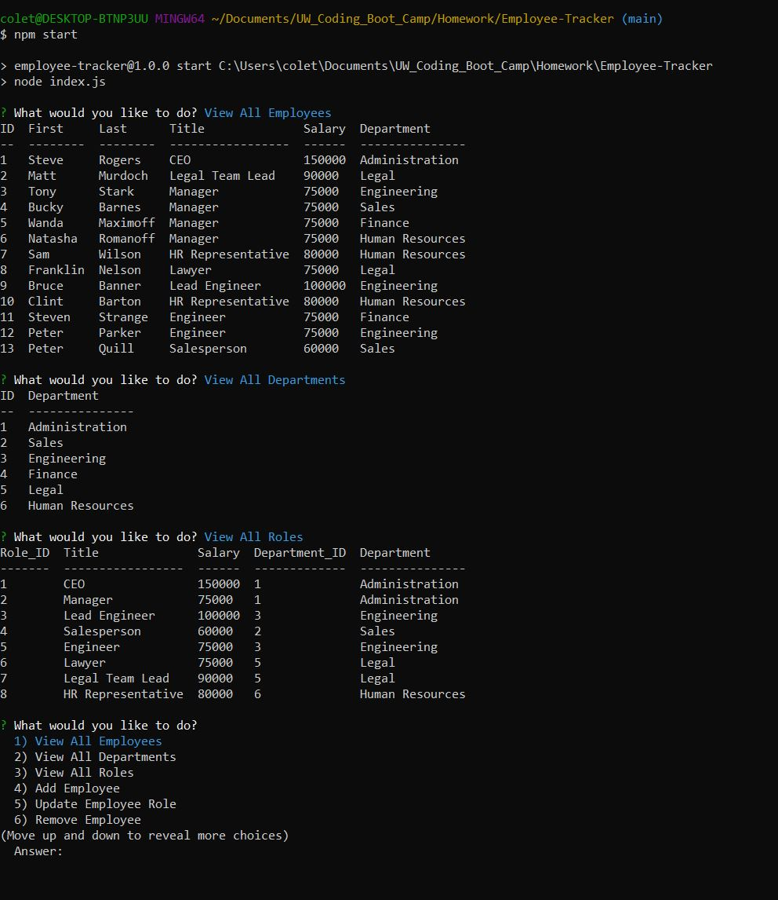

# Employee-Tracker

## Description
    
I created a node.js CMS application that uses Inquirer and MySQL to add, update, and delete employees, roles, and departments for a company to track its employees.
    
## Table of Contents
1. [Installation](#installation)
2. [Usage](#usage)
3. [License](#license)
4. [Questions](#questions)
5. [Credits](#credits)
    
## Installation
    
[Demonstration Video](https://drive.google.com/file/d/1Ukn1CFUrPRgZTT6T2IAxXmgrFp9EtLSg/view?usp=sharing)
    
## Usage

## License
    
MIT License
    
Copyright (c) 2021 Mike Coletta
          
## Questions?
    
[Github](https://github.com/MikeColetta)
    
For any questions, please send me an [email](mailto:coletta.mike@gmail.com).